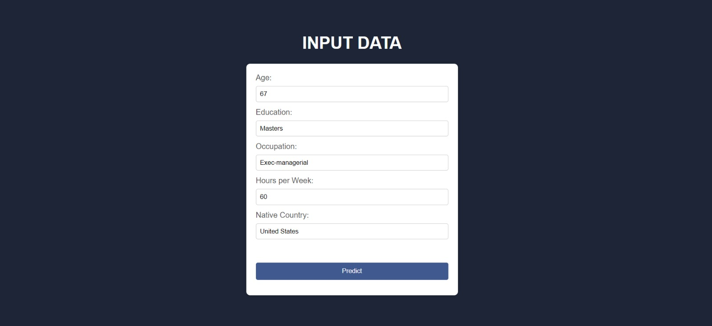
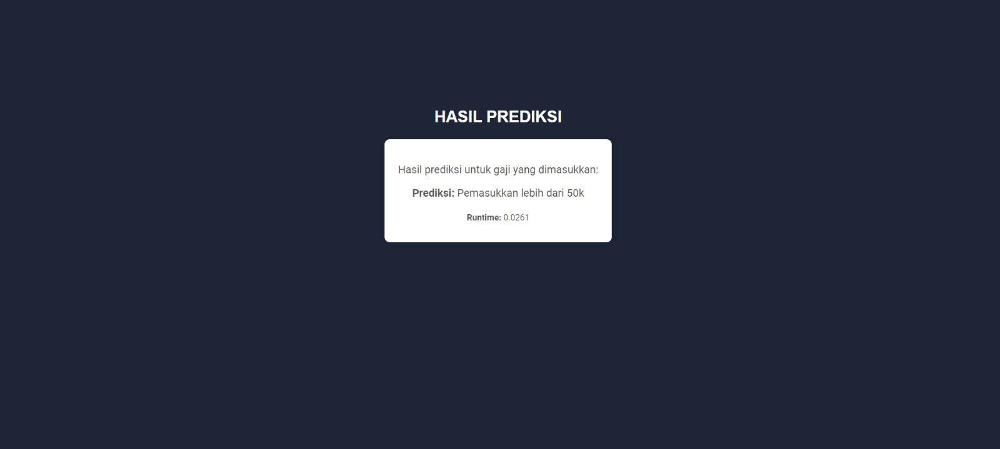
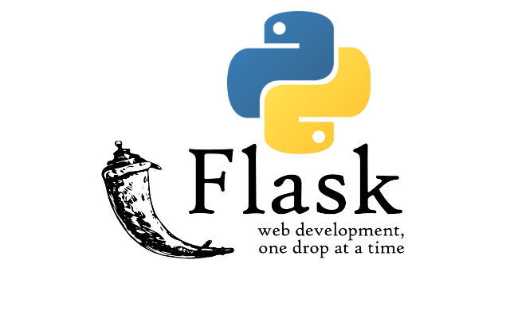

# **Web Model Deployment Using Flask (Data Tabular)**
**Asfa Maghfiratunnisa - 202010370311138**

Project praktikum modul 6 Machine Learning kali ini adalah penerapan model praktikum modul 5 yang sudah dibangun untuk memprediksi pendapatan seseorang berdasarkan hasil input yang sudah ditentukan berdasarkan dataset income.csv, yang dimana model praktikum modul 5 berhasil mempredict true labels berdasarkan income_>50k dengan akurasi 0.80. Maka model yang sudah dibangun dapat diterapkan di modul kali ini.
Berikut atribut-atribut yang harus diinput ke dalam web predict:
- Age: data umur
- Education: data edukasi
- Occupation: data pekerjaan
- Hours per Week: jumlah jam yang dihabiskan untuk bekerja dalam seminggu
- Native Country: asal daerah

# **Tampilan Web**

Gambar di atas adalah tampilan untuk input data yang ingin diprediksi pendapatannya

Gambar di atas adalah hasil prediksi pendapatan 

# **Flask**

Flask adalah sebuah framework web mikro yang ditulis dalam bahasa pemrograman Python. Flask dirancang untuk menjadi sederhana dan mudah digunakan, namun cukup kuat untuk membangun aplikasi web yang berkualitas.
